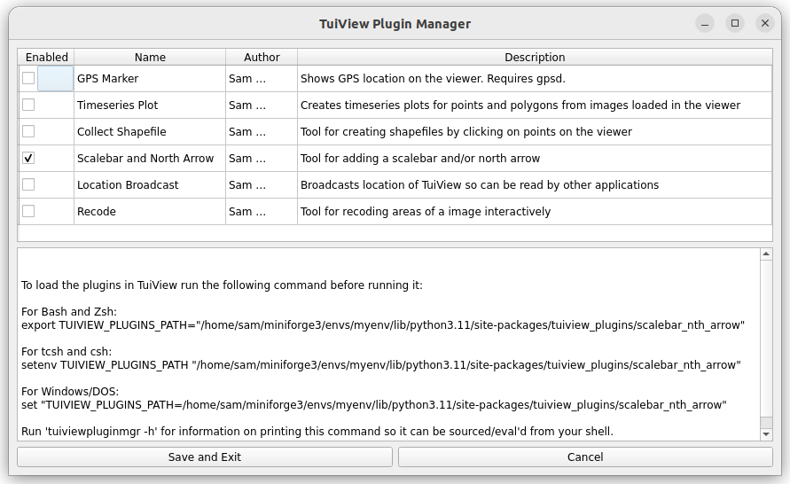

# A collection of TuiView plugins #

**Note this branch is for TuiView 1.3.6 and layer**

For TuiView 1.2.x see the [qt5 branch](https://github.com/ubarsc/tuiview-plugins/tree/qt5). 

For TuiView 1.3.0 to 1.3.5 see the [TuiView 1.3.0 to 1.3.5 branch](https://github.com/ubarsc/tuiview-plugins/tree/tuiview_1.3.0-1.3.5)

These plugins extend TuiView functionality. Mainly as an example of how to build plugins, but hopefully do a few useful things also. 

This package can be used in 3 different ways:

1. Clone repo and copy files or set the `TUIVIEW_PLUGINS_PATH` env var to the location of the individual plugin directions as 
specified here in the [TuiView Plugins Documentation](https://github.com/ubarsc/tuiview/wiki/Plugins#installing-plugin-file). 
Useful for development. 

2. Clone repo and run `pip install .` to install all plugins and use the `tuiviewpluginmgr` GUI application (below)
to:
    a) determine which plugin(s) you wish to have active and,
    b) how to set the `TUIVIEW_PLUGINS_PATH` env var to make this happen for your system.

3. Clone repo and run `pip install .` to install all plugins and import the particular one you want into your Python script
  to use when [scripting TuiView](https://github.com/ubarsc/tuiview/wiki/Saving-Images-From-Python).
